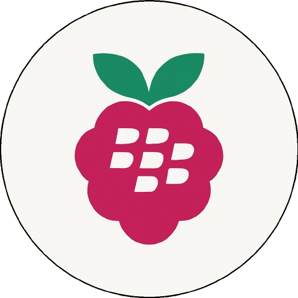
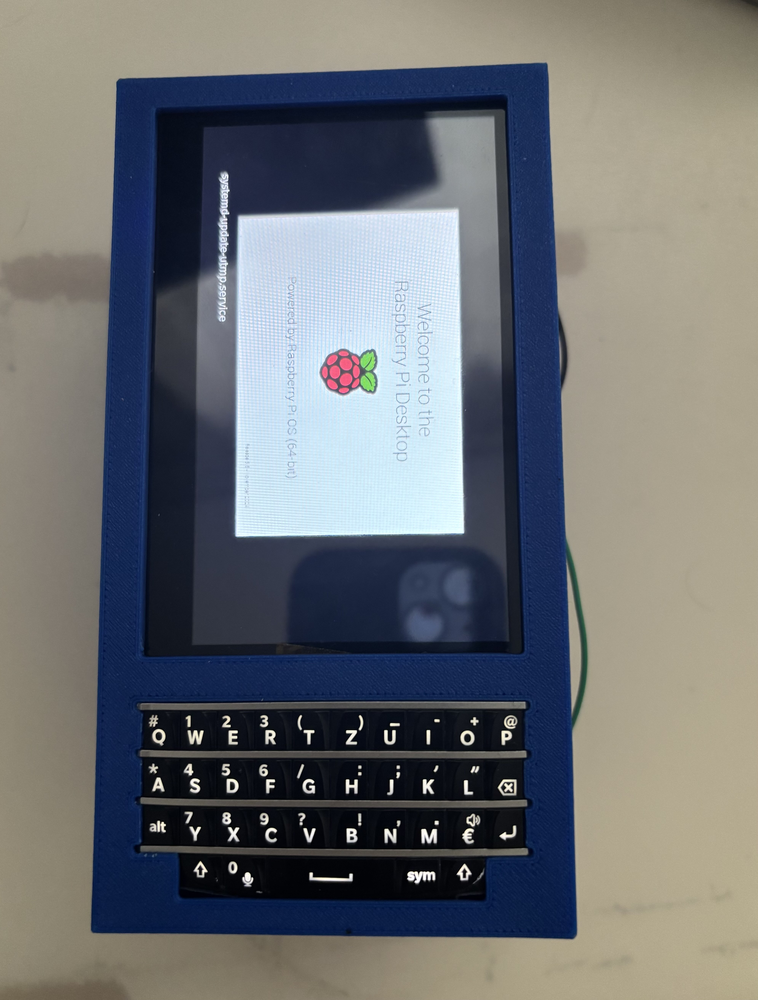
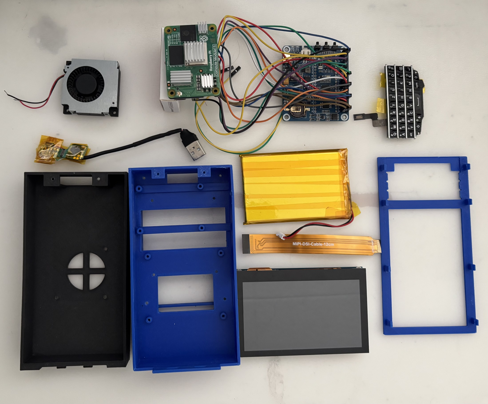

<!-- Improved compatibility of back to top link: See: https://github.com/othneildrew/Best-README-Template/pull/73 -->
<a id="readme-top"></a>
<!--
*** Thanks for checking out the Best-README-Template. If you have a suggestion
*** that would make this better, please fork the repo and create a pull request
*** or simply open an issue with the tag "enhancement".
*** Don't forget to give the project a star!
*** Thanks again! Now go create something AMAZING! :D
-->


<!-- PROJECT SHIELDS -->
<!--
*** I'm using markdown "reference style" links for readability.
*** Reference links are enclosed in brackets [ ] instead of parentheses ( ).
*** See the bottom of this document for the declaration of the reference variables
*** for contributors-url, forks-url, etc. This is an optional, concise syntax you may use.
*** https://www.markdownguide.org/basic-syntax/#reference-style-links
-->
[![Contributors][contributors-shield]][contributors-url]
[![Forks][forks-shield]][forks-url]
[![Stargazers][stars-shield]][stars-url]
[![Issues][issues-shield]][issues-url]
[![MIT License][license-shield]][license-url]
[![LinkedIn][linkedin-shield]][linkedin-url]


<!-- PROJECT LOGO -->
<br />
<div align="center">
  <a href="https://github.com/PetabyteBrain/BlackberryPi">
    
  </a>

<h3 align="center">Blackberry Pi</h3>

  <p align="center">
    The "BlackBerry Pi" project aims to transform a classic BlackBerry phone by integrating a Raspberry Pi as its core, creating a modern, customizable device with a retro design.
    <br />
    <a href="https://github.com/PetabyteBrain/BlackberryPi"><strong>Explore the docs »</strong></a>
    <br />
    <br />
    <a href="https://github.com/PetabyteBrain/BlackberryPi">View Demo</a>
    ·
    <a href="https://github.com/PetabyteBrain/BlackberryPi/issues/new?labels=bug&template=bug-report---.md">Report Bug</a>
    ·
    <a href="https://github.com/PetabyteBrain/BlackberryPi/issues/new?labels=enhancement&template=feature-request---.md">Request Feature</a>
  </p>
</div>


<!-- TABLE OF CONTENTS -->
<details>
  <summary>Table of Contents</summary>
  <ol>
    <li>
      <a href="#about-the-project">About The Project</a>
      <ul>
        <li><a href="#built-with">Built With</a></li>
      </ul>
    </li>
    <li>
      <a href="#getting-started">Getting Started</a>
      <ul>
        <li><a href="#prerequisites">Prerequisites</a></li>
        <li><a href="#installation">Installation</a></li>
        <li><a href="#additional-stuff">Additional stuff</a></li>
      </ul>
    </li>
    <li><a href="#build-example">Build example</a></li>
    <li><a href="#roadmap">Roadmap</a></li>
    <li><a href="#BOM (Bill of Materials)">BOM (Bill of Materials)</a></li>
    <li><a href="#contributing">Contributing</a></li>
    <li><a href="#license">License</a></li>
    <li><a href="#contact">Contact</a></li>
    <li><a href="#acknowledgments">Acknowledgments</a></li>
    <li><a href="#scripts">Scripts</a></li>
    <li><a href="#3d-plans">3D Plans</a></li>
  </ol>
</details>


<!-- ABOUT THE PROJECT -->
## About The Project

<div align="center">
  
</div>

This project is all about bringing the iconic BlackBerry style back to life but with a twist. Instead of using outdated hardware, we’re giving it a modern upgrade by building it around a Raspberry Pi. The idea is to create something that feels unique and different from the sea of touchscreens we see today while keeping it open, customizable, and fun to work with. It’s a mix of nostalgia and innovation for people who want something truly their own.
This project is under development at the moment and is a working process. Updates in this repository are to be expected.

<p align="right">(<a href="#readme-top">back to top</a>)</p>


### Built With

* [![Raspberry][Raspberry.js]][Raspberry-url]
* [![Arduino][Arduino.js]][Arduino-url]

...

<p align="right">(<a href="#readme-top">back to top</a>)</p>


<!-- GETTING STARTED -->
## Getting Started

For getting a good start it is best if you buy or install the following prerequisites and installations.  Additionally for the customization it is easiest if you have access to a 3D-printer.

### Prerequisites

<div align="center">
  
</div>

#### Hardware:
- Raspberry Pi Compute Module 5
- 4.3inch DSI LCD [from Waveshare]
- Nano Base Board A for CM5 [from Waveshare]
- Lipo Batterie 5000mAH 3.7V
- Power Management Hat (B) [from Waveshare]
- Keyboard from an old Blackberry Phone [from e.g. Ricardo]
- DC Brushless Fan DC12V - 0.18A Model: JD4512M12 [from e.g. eBay or a 3D-printer]

#### Software:
- On the Power Management Hat and on the Keyboard, flash these <a targert="_blank" href="#scripts">scripts</a> for correct functionality.

### Installation:

- Raspberry Pi Imager
- Raspberry Pi boot Mass Storage Gadget


### Additional elements:
- Keyboard to display: USB cable with a type A port, the open cable should be connected to the Keyboard directly.
- Extension Cable: We integrated a makeshift female to male USB-C cable so that we can alter the placement of the UBS-C port on our phone.
- Fan to Power Managment Hat: because the fan did not have the same type of port we used jumper wires.

<p align="right">(<a href="#readme-top">back to top</a>)</p>


<!-- BUILD EXAMPLES -->
## Build Example

...

For detailed assembly instructions, see the [Assembly Guide](docs/assembly/Assembly_Guide.md).

<div align="center">
  
</div>


<p align="right">(<a href="#readme-top">back to top</a>)</p>


<!-- ROADMAP -->
## Roadmap

- [X] Create concept & research
- [X] plan prototype
- [X] build 1st Prototype
    - [ ] Optimise and upgrade Prototype
    - [ ] Build V.2
- [ ] Work on a compact version (Raspberry pi zero)
- [X] Choose OS
    - [ ] Adapt OS for Device

See the [open issues](https://github.com/PetabyteBrain/BlackberryPi/issues) for a full list of proposed features (and known issues).

<p align="right">(<a href="#readme-top">back to top</a>)</p>

<!-- Bill of Materials -->
## Bill of Materials

For a detailed list of parts required to build the BlackBerry Pi, refer to our  
[BOM (Bill of Materials)](docs/bom.md).

<p align="right">(<a href="#readme-top">back to top</a>)</p>


<!-- CONTRIBUTING -->
## Contributing

We welcome contributions of any kind — whether it's code, documentation, hardware suggestions, or just cool ideas.

See our [CONTRIBUTING.md](docs/CONTRIBUTING.md) guide for full details on how to get started.

<p align="right">(<a href="#readme-top">back to top</a>)</p>


<!-- LICENSE -->
## License

This Readme file is under the MIT License and the Rest of the Project is under the GNU General Public License. See `LICENSE.txt` for more information.

### MIT License 
```
MIT License

Copyright (c) 2021 Othneil Drew

Permission is hereby granted, free of charge, to any person obtaining a copy
of this software and associated documentation files (the "Software"), to deal
in the Software without restriction, including without limitation the rights
to use, copy, modify, merge, publish, distribute, sublicense, and/or sell
copies of the Software, and to permit persons to whom the Software is
furnished to do so, subject to the following conditions:

The above copyright notice and this permission notice shall be included in all
copies or substantial portions of the Software.

THE SOFTWARE IS PROVIDED "AS IS", WITHOUT WARRANTY OF ANY KIND, EXPRESS OR
IMPLIED, INCLUDING BUT NOT LIMITED TO THE WARRANTIES OF MERCHANTABILITY,
FITNESS FOR A PARTICULAR PURPOSE AND NONINFRINGEMENT. IN NO EVENT SHALL THE
AUTHORS OR COPYRIGHT HOLDERS BE LIABLE FOR ANY CLAIM, DAMAGES OR OTHER
LIABILITY, WHETHER IN AN ACTION OF CONTRACT, TORT OR OTHERWISE, ARISING FROM,
OUT OF OR IN CONNECTION WITH THE SOFTWARE OR THE USE OR OTHER DEALINGS IN THE
SOFTWARE.
```

<p align="right">(<a href="#readme-top">back to top</a>)</p>


<!-- CONTACT -->
## Contact

Spyros Catéchis - spyroscatechis@proton.me

Naomi Bächler - naomi.baechler@protonmail.com

Aram Amir - aram.amir07@gmail.com

Nicolas Ammeter - nicolas.ammeter@hotmail.com

Project Link: [https://github.com/PetabyteBrain/BlackberryPi](https://github.com/PetabyteBrain/BlackberryPi)

<p align="right">(<a href="#readme-top">back to top</a>)</p>


<!-- ACKNOWLEDGMENTS -->
## Acknowledgments

* [Beepy raspberry pi zero](https://beepy.sqfmi.com/)
* [Blackberry Keyboard with Arduino](https://forum.arduino.cc/t/interfacing-blackberry-q10-keypad-to-arduino-and-the-oled-typewriter/342989)
* [Adapter PCB keyboard to usb-C](https://github.com/Dakkaron/Fairberry)
* []()
* [Github Readme Template](https://github.com/othneildrew/Best-README-Template)

### Sources
#### Main idea
* [Blackberry Clone mit Raspberry pi](https://www.heise.de/news/Blackberry-Clone-mit-Raspberry-Pi-9712108.html)
* [Blackberry pi](https://magpi.raspberrypi.com/articles/blackberry-pi)
* [Blackberry pi Handheld](https://hackaday.io/project/195587-blackberrypi-handheld)

#### Hardware
##### Keyboard
* [Blackberry Keyboard with Arduino](https://forum.arduino.cc/t/interfacing-blackberry-q10-keypad-to-arduino-and-the-oled-typewriter/342989)
* [Blackberry Keyboard eevblog](https://www.eevblog.com/forum/beginners/how-to-connect-to-a-very-very-challanging-blackberry-q10-keyboard-connector/msg735622/)
* [Adafruit Blog Blackberry Keyboard](https://blog.adafruit.com/2019/01/14/interfacing-a-blackberry-q10-keyboard-into-your-microcontroller-project-blackberry-arduino-microcontroller/)
* [BBQ10KBD arturo182](https://github.com/arturo182/BBQ10KBD/tree/master)
* [Blackberry tastatur mit Bluetooth/ usb c](https://github.com/wallComputer/bbq20kbd_hw)
* [Adapter PCB keyboard to usb-C](https://github.com/Dakkaron/Fairberry)
* [Update Firmware of UsbASP programmer](https://www.electronics-lab.com/project/usbasp-firmware-update-guide/)
* [Keyboard project github](https://github.com/ZitaoTech/BBQ10-USB_BLE_Keyboard)

##### Other
* [2.8 inch Display](https://www.waveshare.com/wiki/2.8inch_DPI_LCD)
* [Compute module 5  lite, 16gb ram, wifi](https://www.welectron.com/Raspberry-Pi-Compute-Module-CM5116000-Lite-16-GB-RAM-WiFi)
* [Nano Base Board (A)](https://www.berrybase.ch/nano-base-board-a-fuer-raspberry-pi-compute-module-4?c=2410)
* []()

#### Software / OS
##### AOSP
* [Android Open Source Project (AOSP)](https://source.android.com/)
* [AOSP adapted for Raspberry pi](https://konstakang.com/devices/rpi5/)
* [Raspberry pi Vanilla](https://github.com/raspberry-vanilla)
* [Android install instructions](https://www.xda-developers.com/how-to-install-android-on-a-raspberry-pi/)

##### Other OS
* [Lineage OS](https://lineageos.org/)
* [Sailfish OS](https://sailfishos.org/)
* [Plasma mobile](https://plasma-mobile.org/)
* [Mobian](https://mobian-project.org/)
* [Manjaro](https://manjaro.org/products/download/arm)
* [Postmarket OS](https://postmarketos.org/)

#### Extra / Other
* [Pi Zero 2w + blackberry case + e-ink](https://www.reddit.com/r/RASPBERRY_PI_PROJECTS/comments/1ddj94n/pi_zero_2w_blackberry_case_eink_would_this_work/)
* []()

<p align="right">(<a href="#readme-top">back to top</a>)</p>

<!-- SCRIPTS -->
## Scripts:
### Script for Power Management Hat
In [this Link](https://www.waveshare.com/wiki/Power_Management_HAT_(B)) there are all scripts listed, that are needed to make the Power Management Hat work. There are also instructions on the use of them.

### Script for Keyboard
With [this link](https://github.com/Dakkaron/Fairberry) you will find the repo and the scripts for the binding of the input on the Keyboard to the display. Instructions can be found under that Repo.

<p align="right">(<a href="#readme-top">back to top</a>)</p>

<!-- 3D PLANS -->
## 3D Plans:

The 3d Model is made out of 3 parts and can be printed and assembled at Home.

[Here](docs/models) is a Link to the more detailed view of the model and it's construction / assembly.

<p align="right">(<a href="#readme-top">back to top</a>)</p>


<!-- MARKDOWN LINKS & IMAGES -->
<!-- https://www.markdownguide.org/basic-syntax/#reference-style-links -->
[contributors-shield]: https://img.shields.io/github/contributors/PetabyteBrain/BlackberryPi.svg?style=for-the-badge
[contributors-url]: https://github.com/PetabyteBrain/BlackberryPi/graphs/contributors
[forks-shield]: https://img.shields.io/github/forks/PetabyteBrain/BlackberryPi.svg?style=for-the-badge
[forks-url]: https://github.com/PetabyteBrain/BlackberryPi/network/members
[stars-shield]: https://img.shields.io/github/stars/PetabyteBrain/BlackberryPi.svg?style=for-the-badge
[stars-url]: https://github.com/PetabyteBrain/BlackberryPi/stargazers
[issues-shield]: https://img.shields.io/github/issues/PetabyteBrain/BlackberryPi.svg?style=for-the-badge
[issues-url]: https://github.com/PetabyteBrain/BlackberryPi/issues
[license-shield]: https://img.shields.io/github/license/PetabyteBrain/BlackberryPi.svg?style=for-the-badge
[license-url]: https://github.com/PetabyteBrain/BlackberryPi/blob/master/LICENSE.txt
[linkedin-shield]: https://img.shields.io/badge/-LinkedIn-black.svg?style=for-the-badge&logo=linkedin&colorB=555
[linkedin-url]: https://www.linkedin.com/in/spyros-catechis/
[product-screenshot]: images/screenshot.png
[Raspberry.js]: https://img.shields.io/badge/Raspberry%20Pi-A22846?style=for-the-badge&logo=Raspberry%20Pi&logoColor=white
[Raspberry-url]: https://www.raspberrypi.com/
[Arduino.js]: https://img.shields.io/badge/Arduino-00979D?style=for-the-badge&logo=Arduino&logoColor=white
[Arduino-url]: https://www.arduino.cc/
[Vue.js]: https://img.shields.io/badge/Vue.js-35495E?style=for-the-badge&logo=vuedotjs&logoColor=4FC08D
[Vue-url]: https://vuejs.org/
[Angular.io]: https://img.shields.io/badge/Angular-DD0031?style=for-the-badge&logo=angular&logoColor=white
[Angular-url]: https://angular.io/
[Svelte.dev]: https://img.shields.io/badge/Svelte-4A4A55?style=for-the-badge&logo=svelte&logoColor=FF3E00
[Svelte-url]: https://svelte.dev/
[Laravel.com]: https://img.shields.io/badge/Laravel-FF2D20?style=for-the-badge&logo=laravel&logoColor=white
[Laravel-url]: https://laravel.com
