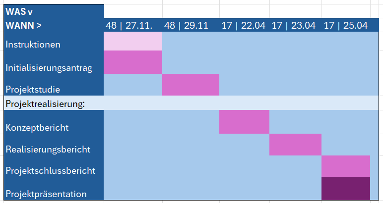

Studie

| Status | In Arbeit / In Prüfung / Abgeschlossen |
| --- | --- |
| Projektname | Blackberry Pi |
| Projektleiter | Spyros Catéchis |
| Auftraggeber | Kurt Järmann |
| Autoren | Aram A. Naomi B. Spyros C. |
| Verteiler | Kurt Järmann |

**Änderungskontrolle, Prüfung, Genehmigung**

| Version | Datum | Beschreibung, Bemerkung | Name oder Rolle |
| --- | --- | --- | --- |
| V 1 | 29.11.24 | Beginn Studie | Aram / Naomi / Spyros |
|  |  |  |  |
|  |  |  |  |
|  |  |  |  |

**Definitionen und Abkürzungen**

| Begriff / Abkürzung | Bedeutung |
| --- | --- |
| Pi | Raspberry Pi |
| BlackBerry Pi | Umbauprojekt: BlackBerry mit Raspberry Pi als Herzstück |
| AOSP | Android Open Source Projekt |

**Referenzen**

| Referenz | Titel, Quelle |
| --- | --- |
| [1] | Blackberry Pi Artikel |

**Inhaltsverzeichnis**

[1 Situationsanalyse 3](#_Toc183806603)

[1.1 Ausgangslage 3](#_Toc183806604)

[1.2 Stärken 3](#_Toc183806605)

[1.3 Schwächen 3](#_Toc183806606)

[2 Ziele 4](#_Toc183806607)

[2.1 Rahmenbedingungen 4](#_Toc183806608)

[2.2 Abgrenzung 5](#_Toc183806609)

[3 Liste der Stakeholder 6](#_Toc183806610)

[4 Anforderungen 8](#_Toc183806611)

[5 Lösungsvarianten 8](#_Toc183806612)

[5.1 Variantenübersicht 8](#_Toc183806613)

[5.2 Beschreibung der Varianten 10](#_Toc183806614)

[6 Bewertung der Varianten (Tabelle) 11](#_Toc183806615)

[7 Lösungsbeschreibung 11](#_Toc183806616)

[8 Projektplanung 14](#_Toc183806617)

[9 Empfehlung 14](#_Toc183806618)

[10 Projektfreigabe 14](#_Toc183806619)

**Abbildungsverzeichnis**

Abb. 1 : Gantt-diagramm ; Excel Tabelle, N.B.

# Situationsanalyse

## Ausgangslage

Die Telefone von BlackBerry waren einst die unangefochtenen Marktführer im Smartphone-Bereich und besonders beliebt bei Geschäftskunden, da sie eine physische Tastatur, hohe Sicherheit und effiziente E-Mail-Verwaltung boten. Mit der Einführung des iPhones und der Touchscreen-Revolution durch Apple verschob sich der Fokus der Nutzer jedoch weg von Tastaturen hin zu grossen, interaktiven Displays. BlackBerry verpasste es, sich schnell genug anzupassen, und verlor schliesslich seinen Platz als Marktführer.

Heute ähneln sich die meisten Smartphones in Design und Funktionalität, was die Vielfalt am Markt stark eingeschränkt hat. In dieser homogenen Welt sehen wir eine Chance, BlackBerry neu zu interpretieren und etwas Einzigartiges zu schaffen.

Die bewährte BlackBerry-Architektur und die physische Tastatur bieten weiterhin viele Vorteile, insbesondere für Nutzer, die ein Gerät mit einer "echten" Tasteneingabe bevorzugen. Durch den Einsatz eines Raspberry Pi als Kern können wir die klassische Hardware mit moderner Technik kombinieren und ein Smartphone kreieren, das sowohl funktional als auch innovativ ist. Dieses neue Gerät vereint das Beste aus zwei Welten: Die Retro-Ästhetik und Haptik eines BlackBerry mit der Flexibilität und Leistungsfähigkeit eines Raspberry Pi – und bringt endlich wieder ein „neues Format“ auf den Smartphone-Markt.

## Stärken

*   Da die meisten Handys heutzutage ähnlich aussehen, hätten wir mit der Ästhetik des Blackberrys und der Tastatur einen Vorteil, da es anders als das Produkt der Konkurrenz ist. Dieses aussehen kann einen attraktiven Verkaufspunkt für Blackberry Enthusiasten sein.
*   Dazu haben wir den Vorteil, dass wir unser Produkt Open Source behalten und deswegen jeder Nutzer genau wissen kann, was es beinhaltet und was er eingeht beim Gebrauch unserer Software.
*   Kosteneffiziente Hardware, Beispiel Raspberry Pi. Der Vorteil davon ist, dass die Reparaturen einfach vom Nutzer / einem Dienst gemacht werden können und günstiger wären als andere moderne Handys.
*   Das Blackberry Pi kann auch mit anderen Betriebssystemen laufen, solange es mit den Drivern und Hardware kompatibel ist.
*   Da es Open Source ist, kann es die Möglichkeit geben, Anpassungen am Gerät zu führen, um diese Benutzerspezifisch zu gestalten und zu entwickeln.

## Schwächen

Hohe Abhängigkeit von proprietärer Software (S1):

Viele Nutzer sind auf geschlossene OS (z.B. iOS, Android) angewiesen. Ein offenes, anpassbares System basierend auf Raspberry Pi kann die Abhängigkeit reduzieren.

Hohe Kosten moderner Smartphones (S2):

Premium-Smartphones sind oft sehr teuer. Ein DIY-Handy auf Basis eines Raspberry Pi bietet eine kostengünstige Alternative, insbesondere für technikaffine Nutzer.

Komplizierte Reparierbarkeit (S3):

Viele aktuelle Smartphones sind schwierig zu reparieren (z.B. durch verklebte Komponenten). Unser Projekt kann durch ein modulares Design mit leicht austauschbaren Teilen punkten.

Mangelnde Software-Upgrades bei älteren Geräten (S4):

Hersteller unterstützen ältere Modelle oft nicht mehr mit Updates, was Sicherheitsrisiken birgt. Ein offenes System erlaubt langfristige Pflege und Updates durch die Community.

Eingeschränkte Anpassbarkeit (S5):

Nutzer können Design, Funktionen und Hardware ihrer Smartphones nur begrenzt anpassen. Mit einem Raspberry Pi sind massgeschneiderte Anpassungen möglich.

# Ziele

Freie OS Wahl(Z1):

Mit einer freien resp. unabhängigen OS Wahl ist die Bandbreite des Blackberrys viel besser und man kann.

(referenziert S1)

Kosten & Marken (Z2):

Solange man nicht nur für die Marke bezahlt ist ein Smartphone schon sehr viel billiger, wenn wir dies mit simpler Technologie verknüpfen, bekommen wir ein einfaches Telefon und faires Preis-Leistung Verhältnis.

(referenziert S2)

Simple Technologie(Z3):

Da wir unser Blackberry Pi mit einem Raspberry Pi ausstatten, ein Screen und noch eine Tastatur hinzufügen ist das ganze Telefon sehr simpel und wenn ein Natel simpel ist, ist es auch simpel zum Reparieren. Was vor allem für ein kostengünstiges design ein Schlüsselziel ist.

(referenziert S3)

Sicherstellung langfristiger Software-Upgrades durch ein offenes System (Z4):

Das Projekt BlackBerry Pi zielt darauf ab, ein Smartphone mit einem offenen Betriebssystem zu entwickeln, das von der Community unterstützt werden kann. Dadurch wird es Nutzern ermöglicht, regelmässig Sicherheitsupdates und neue Funktionen zu erhalten, unabhängig von der Herstellerunterstützung. Dies reduziert Sicherheitsrisiken und verlängert die Nutzungsdauer des Geräts erheblich.

(referenziert S4)

Personalisierung(Z5):

Durch die simple Technologie und die freie OS-wahl ist das Natel individualisierbar. Das heisst der Nutzer kann alles personalisieren, eigene teile zum Telefon zusammenstellen. Wenn der Nutzer sehr viel Technik wissen hat, könnte er sogar zuhause sein Handy personalisieren.

(referenziert S5)

## Rahmenbedingungen

1.  **Zeitliche Rahmenbedingungen**

*   Projektzeitraum:

Das Projekt startet in **KW48** und endet in **KW17**. Innerhalb dieses Zeitraums werden alle wichtigen Meilensteine erreicht, darunter die Planung, praktische Umsetzung und abschliessende Präsentation.

*   Regelmässige Termine:

Wöchentliche Arbeitseinheiten finden im Rahmen des Praxistrainings am Freitagmorgen statt. Dieser regelmässige Zeitblock wird genutzt, um Fortschritte im Projekt zu erzielen und spezifische Aufgaben zu bearbeiten.

1.  **Räumliche Rahmenbedingungen**

*   Arbeitsort:

Die praktischen Arbeiten wie Zusammenbau, Tests und andere Projektschritte werden im Gibb Praxistraining durchgeführt. Hier stehen die notwendigen Ressourcen und Werkzeuge für die Umsetzung zur Verfügung.

1.  **Organisatorische Rahmenbedingungen:**

*   Verantwortlichkeiten:

Der Projektverantwortliche ist Michael Peter, der die übergreifende Koordination übernimmt.

Das Praxistraining wird vom Auftragsgeber geführt, der die praktische Umsetzung und Betreuung leitet.

## Abgrenzung

Die Abgrenzung definiert, welche Aspekte und Bereiche das Projekt _BlackBerry Pi_ nicht abdeckt, um den Umfang klar zu definieren und Missverständnisse zu vermeiden. Dies hilft, Fokus und Ressourcen gezielt einzusetzen. Im Folgenden werden einige Ideen und Beispiele aufgeführt:

1.  **Ideen zur Abgrenzung**

*   **Kommerzialisierung und Serienproduktion**
    *   Das Projekt ist rein prototypisch und wird keine grossflächige Serienproduktion oder Vermarktung umfassen.
    *   Beispiel: Es wird keine umfassende Marketingkampagne erstellt oder Logistik für den Verkauf organisiert.
*   **Entwicklung von Drittanbieter-Software**
    *   Das Projekt umfasst die Installation eines Betriebssystems, jedoch keine Entwicklung komplexer Software oder Apps von Grund auf.
    *   Beispiel: Die Anpassung bestehender Apps an das System wird nicht durchgeführt.
*   **Vollständige Kompatibilität mit BlackBerry-Diensten**
    *   Historische BlackBerry-Dienste wie BBM (BlackBerry Messenger) oder BlackBerry-Serverintegration werden nicht reaktiviert oder unterstützt.
    *   Beispiel: Die E-Mail-Push-Funktion von alten BlackBerry-Geräten wird nicht wiederhergestellt.
*   **Hardware-Optimierung auf Industrie-Standard**
    *   Es wird kein auf Effizienz oder Produktionskosten optimiertes Motherboard entwickelt, sondern ein Raspberry Pi genutzt.
    *   Beispiel: Statt einer massgeschneiderten Platine bleibt der Fokus auf der Integration bestehender Komponenten.
*   **Langfristiger Support und Wartung**
    *   Das Projekt wird keine langfristige Pflege des Betriebssystems oder regelmässige Updates garantieren.
    *   Beispiel: Sicherheitsupdates oder neue Features nach der Projektlaufzeit sind nicht vorgesehen.

1.  **Beispiele für typische Ausschlüsse bei einem solchen Projekt**

*   **Mobilfunkzertifizierung**
    *   Das Projekt wird keine umfassende Zertifizierung für den Einsatz in Mobilfunknetzen vornehmen.
    *   Beispiel: Keine Freigabe von Mobilfunkanbietern für LTE/5G.
*   **Multiplattform-Unterstützung**
    *   Es wird nicht darauf abgezielt, das Betriebssystem auf andere Geräte zu portieren.
    *   Beispiel: Der Prototyp bleibt auf das BlackBerry-Gehäuse beschränkt.
*   **Umfassende Benutzeroberfläche**
    *   Es wird keine voll ausgereifte Benutzeroberfläche wie bei kommerziellen Betriebssystemen erstellt.
    *   Beispiel: Minimalistische Funktionalität reicht aus, z. B. für grundlegende Kommunikation oder Terminal-Anwendungen.
*   **Hohe Produktionsqualität**
    *   Da es sich um einen Prototyp handelt, wird keine perfekte Anpassung oder Veredelung der Hardware erfolgen.
    *   Beispiel: Das Gehäuse könnte sichtbare Modifikationen wie Schraublöcher oder zusätzliche Kabel aufweisen.
*   **Komplette Rückwärtskompatibilität**
    *   Das Gerät wird nicht die Fähigkeit haben, alle historischen Funktionen und Anwendungen eines BlackBerry vollständig zu reproduzieren.
    *   Beispiel: Die originale BlackBerry-OS-Funktionalität wird nicht unterstützt.

1.  **Fazit zur Abgrenzung**

Die Abgrenzung soll verhindern, dass das Projekt über seine Kapazitäten hinauswächst. Der Fokus liegt auf einem funktionalen Prototyp, der die Idee eines BlackBerry-Smartphones mit Raspberry-Pi-Kern demonstriert. Bereiche wie Kommerzialisierung, umfangreiche Softwareentwicklung oder langfristiger Support bleiben bewusst ausserhalb des Projektumfangs.

# Liste der Stakeholder

Das Projekt _BlackBerry Pi_ hat verschiedene Stakeholder, die entweder direkt in die Entwicklung und Umsetzung einbezogen sind oder indirekt von den Ergebnissen des Projekts profitieren oder beeinflusst werden. Die Stakeholder lassen sich in folgende Kategorien unterteilen:

1.  **Primäre Stakeholder (direkt betroffen):**

*   **Kunde**
    *   Endnutzer des Geräts, die ein Interesse an einem Smartphone mit physischer Tastatur und modernem Betriebssystem haben.
    *   Erwartungen: Ein hochwertiges, funktionsfähiges und innovatives Gerät, das Retro-Charme mit moderner Technik verbindet.
*   **Entwickler & Projektmanager**
    *   Projektteam, bestehend aus Entwicklern und dem Projektleiter, das für die technische Umsetzung und die Organisation des Projekts verantwortlich ist.
    *   Erwartungen: Klare Anforderungen, Ressourcen, realistische Zeitpläne und Unterstützung durch den Auftraggeber.
*   **Auftraggeber**
    *   Kurt Järmann, der das Projekt ins Leben gerufen hat und als Schnittstelle zwischen Team und Kunde fungiert.
    *   Erwartungen: Ein funktionierender Prototyp, der die Machbarkeit des Konzepts beweist.

1.  **Sekundäre Stakeholder (indirekt betroffen):**

*   **Geldgeber & Investoren**
    *   Personen oder Institutionen, die die finanziellen Mittel bereitstellen, um die Entwicklung zu ermöglichen.
    *   Erwartungen: Transparente Kommunikation, nachvollziehbare Kostenpläne und eine realistische Aussicht auf zukünftige Renditen oder Marktinteresse.
*   **Technikbegeisterte**
    *   Enthusiasten und Maker, die sich für DIY-Technologie und innovative Hardwarelösungen interessieren.
    *   Erwartungen: Detaillierte Dokumentation und eventuell Open-Source-Freigabe der Projektdaten, um Nachbauten zu ermöglichen.
*   **Konkurrenten**
    *   Andere Unternehmen oder Projekte, die sich mit Retro-Technologie oder innovativen Smartphones beschäftigen.
    *   Erwartungen: Aufmerksamkeit auf dem Markt, Interesse an der Strategie und potenzielle Wettbewerbsvorteile durch eigene Innovationen.

1.  **Weitere Stakeholder:**

*   **Geschäftsleitung und betroffene Abteilungen der Stammorganisation**
    *   Interne Gruppen, die über den Fortschritt des Projekts informiert werden müssen, wie z. B. Marketing und Vertrieb, falls das Produkt kommerzialisiert wird.
*   **Ämter und Regulierungsbehörden**
    *   Institutionen, die eventuell für rechtliche Genehmigungen und Zertifizierungen bei einer möglichen Markteinführung des Geräts benötigt werden.
*   **Medien und Öffentlichkeit**
    *   Technologie-Journalisten und Interessierte, die über den Fortschritt und die Ergebnisse des Projekts berichten könnten.

1.  **Kommunikation mit Stakeholdern**

Es ist wichtig, regelmässig und zielgerichtet mit den Stakeholdern zu kommunizieren:

*   **Kunden** erhalten Updates über den Entwicklungsstand.
*   **Entwickler und Projektleiter** führen tägliche Abstimmungen durch.
*   **Geldgeber und Investoren** werden in Meetings über Budget und Fortschritte informiert.
*   **Technikbegeisterte** könnten über Blogs oder Foren eingebunden werden, um Feedback zu erhalten und Interesse zu wecken.
*   **Medien und Öffentlichkeit** werden über fertige Prototypen und Innovationen in einer Pressemitteilung informiert.

# Anforderungen

| Anforderung | Bezeichnung | Beschreibung | Ziel(e) |
| --- | --- | --- | --- |
| Offene Software-Architektur | A1 | Das System muss auf einem offenen Betriebssystem basieren, das langfristige Software-Upgrades und Anpassungen durch die Community ermöglicht. | Z1, Z4 |
| Modulares Hardware-Design | A2 | Das Telefon muss so konstruiert sein, dass Komponenten wie Display, Tastatur oder Akku einfach ausgetauscht oder aktualisiert werden können. | Z3 |
| Freie Betriebssystemwahl | A3 | Es soll möglich sein, verschiedene Betriebssysteme (z. B. Linux-Distributionen) auf dem Gerät zu installieren und zu nutzen. | Z1, Z5 |
| Kosteneffizienz | A4 | Die verwendeten Komponenten müssen günstig sein, sodass das Gerät ein faires Preis-Leistungs-Verhältnis bietet und unter den Kosten gängiger Smartphones bleibt. | Z2 |
| Einfache Reparierbarkeit | A5 | Das Telefon soll mit Standardwerkzeugen leicht zu reparieren sein, um die Lebensdauer zu verlängern und Nachhaltigkeit zu fördern. | Z3 |
| Hohe Anpassbarkeit | A6 | Nutzer sollen das Gerät sowohl in Hardware (z. B. Gehäuse-Design) als auch in Software (z. B. Benutzeroberfläche) individuell anpassen können. | Z5, Z1 |

# Lösungsvarianten

## Variantenübersicht

**1\. Gekauftes Handy von Blackberry**

*   **Beschreibung:  
    Erwerb eines bestehenden Modells, wie z. B. des BlackBerry Key2.**
*   **Vorteile:**
    *   **Fertiges Produkt ohne Entwicklungsaufwand.**
    *   **Sofort einsatzbereit und zuverlässig.**
    *   **Professionelles Design und getestete Hardware.**
*   **Nachteile:**
    *   **Hohe Kosten im Vergleich zum Eigenbau.**
    *   **Einschränkungen bei Anpassungen (Hard- und Software).**
    *   **Abhängigkeit von Hersteller-Updates und proprietären Systemen.**
*   **Link zur Beschreibung:  
    **[**BlackBerry Key2 auf Wikipedia**](https://en.wikipedia.org/wiki/BlackBerry_Key2)

**2\. Eigener Prototyp zusammenbauen**

*   **Beschreibung:  
    Eigenbau eines Blackberry-Pi-Handys durch die Kombination von modularer Hardware und frei verfügbarer Software.**
*   **a. Hardware**
*   **Komponenten:**
    *   **Raspberry Pi: Als Hauptrechner (z. B. Pi Zero 2 W oder Pi 4).**
    *   **Display: Kleines Touchscreen-Display (z. B. 3.5 Zoll LCD).**
    *   **Tastatur: Physische Tastatur (z. B. DIY-Module oder vorgefertigte Lösungen).**
    *   **Gehäuse: Eigenbau, z. B. aus 3D-Druckteilen.**
    *   **Zusatzmodule: Kamera, Akku, Lautsprecher und Mikrofon.**
*   **b. Software**
*   **Betriebssystem: Installation eines freien Betriebssystems wie Raspberry Pi OS, Ubuntu oder LineageOS.**
*   **Vorteile:**
    *   **Maximale Anpassungsfähigkeit und Kosteneffizienz.**
    *   **Open-Source-Software ermöglicht langfristige Updates und Pflege.**
    *   **Lern- und Innovationspotenzial.**
*   **Nachteile:**
    *   **Zeitintensiv und technisch anspruchsvoll.**
    *   **Mögliche Inkompatibilitäten zwischen Komponenten.**

**3\. Modifikation eines bestehenden Smartphones**

*   **Beschreibung:  
    Anpassung eines vorhandenen Smartphones, indem Software ersetzt wird und Hardware soweit möglich modifiziert wird.**
*   **a. Hardware-Anpassungen**
*   **Basisgerät: Nutzung eines alten oder kostengünstigen Smartphones, das bereits eine physische Tastatur besitzt (z. B. ältere Blackberry-Modelle).**
*   **Zusatzmodule: Externe Tastaturen, neue Gehäuse oder Austausch von Komponenten wie Akku.**
*   **b. Software-Anpassungen**
*   **Custom ROMs: Installation eines freien Betriebssystems wie LineageOS, /e/OS oder anderen angepassten Android-Versionen.**
*   **Optimierung: Entfernen von Bloatware und Hinzufügen von sicherheitsorientierten Apps.**
*   **Vorteile:**
    *   **Schneller und weniger zeitaufwendig als ein kompletter Eigenbau.**
    *   **Kosteneinsparung durch die Wiederverwendung bestehender Geräte.**
    *   **Direkter Fokus auf Nachhaltigkeit und Ressourcenschonung.**
*   **Nachteile:**
    *   **Begrenzte Anpassbarkeit der Hardware.**
    *   **Mögliche Inkompatibilitäten bei Softwaremodifikationen.**
    *   **Gerät bleibt abhängig von der ursprünglichen Hardwarequalität.**

**4\. Nutzung eines älteren Smartphones mit angepasstem Open-Source-Betriebssystem**

*   **Beschreibung:  
    Verwendung eines älteren, gebrauchten Smartphones (z. B. ein älteres Android-Gerät) und Installation eines offenen Betriebssystems wie LineageOS oder /e/OS. Dieses Vorgehen ermöglicht es, ein funktionales, kostengünstiges Smartphone zu erstellen, das an die eigenen Bedürfnisse angepasst werden kann, ohne ein Gerät von Grund auf neu zu bauen.**
*   **a. Hardware**
*   **Basisgerät: Ein günstiges, gebrauchtes oder älteres Smartphone (z. B. ein älteres Android-Gerät oder ein gebrauchtes Gerät von Marken wie Fairphone oder Nexus).**
*   **Anpassungen: Gegebenenfalls werden einfache Hardware-Anpassungen vorgenommen, wie der Austausch des Akkus oder das Hinzufügen von Zubehör (z. B. einer physischen Tastatur).**
*   **b. Software**
*   **Betriebssystem: Installation eines offenen, freien Betriebssystems wie LineageOS oder /e/OS. Diese Systeme bieten regelmässige Updates und die Freiheit, die Software an die eigenen Anforderungen anzupassen.**
*   **Optimierung: Entfernen von Bloatware, Anpassung der Benutzeroberfläche und Installation sicherer, funktioneller Apps.**
*   **Vorteile:**
*   **Kostenersparnis: Die Nutzung eines gebrauchten Smartphones ist deutlich günstiger als der Bau eines eigenen Geräts.**
*   **Schnelle Umsetzung: Die Anpassung eines bestehenden Geräts dauert weniger Zeit als der Eigenbau.**
*   **Zukunftssicher: Die Nutzung eines offenen Betriebssystems bedeutet, dass regelmässige Updates und Sicherheits-Patches von der Community bereitgestellt werden.**
*   **Nachhaltigkeit: Wiederverwendung und Recycling von Geräten verringert den Elektronikmüll.**
*   **Nachteile:**
*   **Begrenzte Anpassbarkeit der Hardware: Die Hardware kann nicht vollständig angepasst werden, da sie auf einem bestehenden Gerät basiert.**
*   **Abhängigkeit von der ursprünglichen Hardwarequalität: Das Endprodukt ist immer noch an die Begrenzungen der Originalhardware gebunden.**

## Beschreibung der Varianten

**1\. Eigener Prototyp zusammenbauen**

*   **Beschreibung**:  
    Der erste Schritt besteht darin, ein eigenes Gerät von Grund auf zu bauen, indem man Hardware und Software kombiniert. Der Hauptbaustein ist ein **Raspberry Pi**, auf dem ein offenes Betriebssystem läuft. Dazu kommen ein kleines Touchscreen-Display, eine physische Tastatur und eine individuelle Gehäusekonstruktion, die entweder selbst designt oder durch 3D-Druckteile erstellt wird. Die Komponenten wie Kamera, Lautsprecher und Mikrofon können ebenfalls je nach Bedarf hinzugefügt werden. Diese Variante bietet die grösste Anpassungsfreiheit, da sowohl die Hardware als auch die Software nach den eigenen Anforderungen gestaltet werden können.  
    Das Ziel ist es, ein funktionales Smartphone zu bauen, das langfristig pflegbar ist und mit den neuesten Software-Updates versorgt werden kann. Dies bedeutet jedoch, dass der Entwicklungsaufwand und die technische Komplexität relativ hoch sind.

**2\. Modifikation eines bestehenden Smartphones**

*   **Beschreibung**:  
    Bei dieser Variante wird ein bestehendes Smartphone verwendet, das bereits grundlegende Funktionen erfüllt, aber durch Modifikationen in Hardware und Software den individuellen Anforderungen angepasst wird. Als Basisgerät könnte ein älteres, kostengünstiges Modell gewählt werden. Eine typische Wahl sind Geräte mit physischen Tasten, wie die älteren **Blackberry-Modelle**.  
    In Bezug auf Software wird ein offenes Betriebssystem wie **LineageOS** oder **/e/OS** aufgespielt, um die Kontrolle über Updates und Anpassungen zu behalten. In der Hardware können Komponenten wie der Akku ausgetauscht oder eine externe Tastatur hinzugefügt werden, um die Bedienbarkeit zu verbessern. Diese Variante ist weniger aufwendig als der komplette Eigenbau, erfordert jedoch auch einige technische Fähigkeiten und bietet nicht die gleiche Flexibilität wie der Prototypenbau.

**3\. Nutzung eines älteren Smartphones mit angepasstem Open-Source-Betriebssystem**

*   **Beschreibung**:  
    Bei dieser Lösung wird ein älteres, gebrauchtes Smartphone genutzt, das mit einem Open-Source-Betriebssystem wie **LineageOS** oder **/e/OS** ausgestattet wird. Das Ziel ist es, ein funktionales Smartphone zu schaffen, das an die eigenen Bedürfnisse angepasst ist und von der Community regelmässig mit Updates versorgt wird. Hierbei liegt der Fokus auf der Software und der Minimierung der Bloatware, während die Hardware weitgehend unverändert bleibt.  
    Ein Vorteil dieser Lösung ist die Kosteneffizienz, da gebrauchte Geräte oft zu einem Bruchteil des Preises eines neuen Smartphones erhältlich sind. Es handelt sich um eine schnelle und nachhaltige Lösung, da alte Geräte wiederverwendet und für eine moderne Nutzung optimiert werden. Diese Variante ist besonders für Nutzer geeignet, die Wert auf ein einfaches, funktionales Gerät legen, ohne tief in die Hardware-Entwicklung eingreifen zu müssen.

**4\. Gekauftes Handy von Blackberry**

*   **Beschreibung**:  
    Die einfachste Variante besteht darin, ein bestehendes Modell, wie z. B. das **BlackBerry Key2**, direkt zu kaufen. Dies ist die Lösung mit dem geringsten Aufwand, da das Gerät sofort einsatzbereit ist. Die Blackberry-Geräte bieten eine bewährte Hardware, die für Business-Anwendungen und effiziente Textbearbeitung optimiert ist. Ein Vorteil dieser Option ist die Zuverlässigkeit des Produkts und das professionelle Design, das gut getestet ist.  
    Allerdings gibt es bei dieser Variante Einschränkungen, wenn es um die Anpassung der Software und die Kontrolle über Updates geht. Man ist weiterhin auf den Hersteller angewiesen, was in Bezug auf langfristige Updates und die Freiheit, das Gerät nach eigenen Wünschen zu gestalten, problematisch sein kann. Zudem sind die Kosten im Vergleich zu den anderen Varianten relativ hoch, und man zahlt auch für die Marke.

# Bewertung der Varianten (Tabelle)

| Kriterien | Gewichtung | Eigener Prototyp | Modifikation | Open-Source-Gerät | Blackberry kaufen |
| --- | --- | --- | --- | --- | --- |
| Anpassungsfähigkeit | 25% | 5 | 4 | 3 | 1 |
| Lernpotenzial & Innovation | 20% | 5 | 3 | 2 | 1 |
| Kosten | 20% | 3 | 4 | 5 | 2 |
| Unabhängigkeit | 15% | 5 | 3 | 3 | 1 |
| Komplexität | 15% | 2 | 4 | 5 | 5 |
| Nachhaltigkeit | 5% | 4 | 5 | 5 | 2 |
| Gesamtbewertung | 100% | 4.4 | 3.8 | 3.4 | 2.0 |

**1: Eigener Prototyp zusammenbauen (4.4 Punkte)**  
Diese Variante wird nun als beste Lösung bewertet, da sie maximale Anpassungsfähigkeit, Unabhängigkeit und Lernpotenzial bietet. Sie ist besonders geeignet für Projekte, die auf Innovation und langfristige Kontrolle abzielen.

**2: Modifikation eines bestehenden Smartphones (3.8 Punkte)**  
Eine solide Lösung mit hoher Nachhaltigkeit und moderatem Aufwand. Jedoch begrenzt in der Anpassungsfähigkeit im Vergleich zum Eigenbau.

**3: Nutzung eines älteren Smartphones mit Open-Source-Betriebssystem (3.4 Punkte)**  
Eine pragmatische, kostengünstige Lösung, die jedoch weniger Lernpotenzial und Hardware-Freiheit bietet.

**4: Gekauftes Handy von BlackBerry (2.0 Punkte)**  
Die schlechteste Option in diesem Szenario, da sie weder Anpassungsfähigkeit noch Unabhängigkeit bietet und teuer ist.

# Lösungsbeschreibung

Die gewählte Lösung ist der **Eigenbau eines Smartphones**, das vollständig auf den spezifischen Anforderungen basiert und maximal anpassbar ist. Der Hauptbaustein des Prototyps ist ein **Raspberry Pi**, der als zentrale Recheneinheit fungiert und ein offenes Betriebssystem wie **Raspberry Pi OS, Ubuntu** oder **LineageOS** ausführt. Dieser Ansatz ermöglicht es, sowohl die Hardware als auch die Software an die individuellen Bedürfnisse anzupassen.

1.  **Komponenten der Lösung**

*   **Hardware**
    *   **Raspberry Pi**: Der Hauptprozessor des Geräts, z. B. ein Raspberry Pi 4 oder Pi Zero 2 W, wird als Basis verwendet. Der Raspberry Pi bietet genügend Leistung für den Betrieb eines Smartphones und ermöglicht eine einfache Integration mit anderen Hardware-Komponenten.
    *   **Display**: Ein kleines Touchscreen-Display (z. B. 3,5 Zoll LCD) wird verwendet, um das Benutzerinterface darzustellen. Es wird direkt mit dem Raspberry Pi verbunden und ermöglicht eine einfache Bedienung des Geräts.
    *   **Physische Tastatur**: Um die Benutzerfreundlichkeit zu erhöhen, wird eine physische Tastatur verwendet, entweder als DIY-Modul oder vorgefertigte Lösung, was für die Zielgruppe, die Wert auf physische Tasten legt, von besonderem Vorteil ist.
    *   **Gehäuse**: Das Gehäuse wird entweder selbst designt oder durch 3D-Druckteile gefertigt, um das Gerät individuell anpassbar zu machen.
    *   **Zusatzmodule**: Für grundlegende Funktionen wie Fotoaufnahmen, Audioaufnahmen und Kommunikation werden Module wie **Kamera**, **Lautsprecher**, **Mikrofon** und **Akku** integriert. Diese Komponenten sind ebenfalls modular, sodass sie bei Bedarf einfach ersetzt oder aktualisiert werden können.
*   **Software**
    *   **Betriebssystem**: Das Betriebssystem wird entweder durch ein leicht anpassbares Open-Source-Betriebssystem wie **Raspberry Pi OS** oder eine andere freie Linux-Distribution wie **Ubuntu** oder **LineageOS** installiert. Diese Systeme ermöglichen eine langfristige Unterstützung und Updates durch die Open-Source-Community.
    *   **Anpassbarkeit**: Nutzer können sowohl die Benutzeroberfläche als auch die Systemsoftware individuell anpassen. Dies kann durch den Einsatz von benutzerdefinierten ROMs oder das Entfernen von Bloatware erfolgen, um das System zu optimieren und die Kontrolle über Updates zu behalten.
*   **Vorteile der Lösung**
    *   **Maximale Anpassungsfähigkeit**: Sowohl Hardware als auch Software sind vollständig anpassbar, sodass das Gerät genau nach den Bedürfnissen der Nutzer konzipiert werden kann. Dies umfasst Änderungen am Gehäuse, an der Benutzeroberfläche und an der Funktionalität.
    *   **Lernpotenzial & Innovation**: Der Eigenbau des Geräts bietet umfangreiche Lernmöglichkeiten im Bereich der Hardware- und Software-Integration. Dies fördert das Verständnis und die Kontrolle über die Technologie und ermöglicht kontinuierliche Innovationen.
    *   **Kostenersparnis**: Die Verwendung von Open-Source-Komponenten und kostengünstigen Bauteilen ermöglicht es, das Smartphone zu einem deutlich geringeren Preis zu bauen als der Kauf eines vergleichbaren Geräts auf dem Markt. Die Kosten für Komponenten sind niedriger als die für Marken-Smartphones.
    *   **Unabhängigkeit und Kontrolle**: Durch den Eigenbau behält man die vollständige Kontrolle über das Gerät. Das bedeutet, dass der Nutzer nicht von Herstellerupdates oder proprietären Softwarelösungen abhängig ist.
    *   **Einfache Reparierbarkeit**: Da das Design modular ist, können Komponenten wie Display, Tastatur, Kamera und Akku einfach ausgetauscht oder repariert werden, was die Lebensdauer des Geräts verlängert und zur Nachhaltigkeit beiträgt.
*   **Nachteile der Lösung**
    *   **Komplexität**: Der Eigenbau eines Smartphones ist technisch anspruchsvoll und zeitintensiv. Es erfordert Kenntnisse in der Hardware-Integration, Software-Installation und Problemlösung.
    *   **Mögliche Inkompatibilitäten**: Die Vielzahl von Komponenten und die Notwendigkeit, diese miteinander zu integrieren, können zu Inkompatibilitäten führen, was zusätzliche Anpassungen und Tests erfordert.
    *   **Entwicklungsaufwand**: Der Entwicklungsprozess für einen eigenen Prototypen ist langwierig und erfordert umfassende Planung und technische Fertigkeiten, um ein funktionierendes und robustes Gerät zu erstellen.

1.  **Überprüfung der Anforderungen**

| Anforderung | Beschreibung | Ziel(e) | Erfüllung |
| --- | --- | --- | --- |
| Offene Software-Architektur (A1) | Das System basiert auf einem offenen Betriebssystem, das langfristige Updates ermöglicht. | Z1, Z4 | Vollständig erfüllt |
| Modulares Hardware-Design (A2) | Komponenten wie Display, Tastatur und Akku können leicht ausgetauscht oder aktualisiert werden. | Z3 | Vollständig erfüllt |
| Freie Betriebssystemwahl (A3) | Verschiedene Betriebssysteme wie Linux-Distributionen können installiert werden. | Z1, Z5 | Vollständig erfüllt |
| Kosteneffizienz (A4) | Die verwendeten Komponenten sind günstig und das Gerät bleibt unter den Kosten eines gängigen Smartphones. | Z2 | Vollständig erfüllt |
| Einfache Reparierbarkeit (A5) | Das Gerät kann mit Standardwerkzeugen leicht repariert werden, wodurch es langlebig bleibt. | Z3 | Vollständig erfüllt |
| Hohe Anpassbarkeit (A6) | Nutzer können das Gerät sowohl in Hardware (z. B. Gehäuse) als auch in Software (z. B. UI) anpassen. | Z5, Z1 | Vollständig erfüllt |

1.  **Fazit**

Der Eigenbau eines Smartphones erfüllt alle relevanten Anforderungen, von der offenen Software-Architektur bis zur hohen Anpassbarkeit und Reparierbarkeit. Diese Lösung ist besonders geeignet, um die Ziele der Unabhängigkeit, Kosteneffizienz und Innovation zu erreichen. Trotz der höheren Komplexität bietet der Eigenbau eine langfristige Perspektive, die es ermöglicht, das Gerät kontinuierlich weiterzuentwickeln und an die eigenen Bedürfnisse anzupassen.

# Projektplanung

Abb. 1 Gantt-diagramm

# Empfehlung

Wir empfehlen, das Projekt zugunsten des **Eigenbaus eines Prototypen** freizugeben. Diese Lösung ermöglicht eine massgeschneiderte, **offene Software-Architektur** und ein **modulares Hardware-Design**, das einfache Wartung und Reparatur sicherstellt. Der Eigenbau bietet maximale **Anpassungsfähigkeit** und **kostengünstige Komponenten**, während er gleichzeitig **Lernpotenzial** und **Innovationsmöglichkeiten** fördert.

Trotz des höheren Aufwands bietet der Eigenbau langfristig mehr Unabhängigkeit, Nachhaltigkeit und Flexibilität als der Kauf eines fertigen Produkts.

**Fazit:** Der Eigenbau stellt die beste Lösung dar, um das Projekt kostengünstig und zukunftssicher umzusetzen.

# Projektfreigabe

Hiermit bestätigt der Auftraggeber die Freigabe des Projekts:

­­­­­­­­­­­­­­­­­­­­­­\_\_\_\_\_\_\_\_\_\_\_\_\_\_\_\_\_\_\_\_\_\_\_\_ \_\_\_\_\_\_\_\_\_\_\_\_\_\_\_\_\_\_\_\_\_\_\_

Der Auftraggeber Der Projektleiter

(Ort, Datum, Unterschrift) (Ort, Datum, Unterschrift)