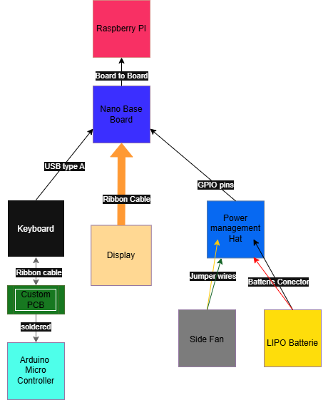

# BlackberryPi Assembly Guide

## Table of Contents
1. [Fastening Method](#1-fastening-method)
2. [Display and Keyboard Mounting](#2-display-and-keyboard-mounting)
3. [Electronics](#3-electronics)
4. [Wiring or Cables](#4-wiring-or-cables)
5. [Assembly Tools Required](#5-assembly-tools-required)
6. [Keyboard Setup](#6-keyboard-setup)
7. [Images and Diagrams](#7-images-and-diagrams)

---

## 1. Fastening Method

- The device is built around a main center piece.
- **Front Piece**:
  - Contains a slot for the keyboard and a display cutout to hide the edges.
  - Attached using 8 clips that snap into place when pressed into the main part.
- **Backplate**:
  - Slides into 2 slots at the bottom (similar to a battery case).
  - Secured with 2 screws at the top.

> 🔩 Total screws: **17**  
> Each screw hole is approximately **2.5 mm** in diameter.

---

## 2. Display and Keyboard Mounting

- **Display**:
  - Mounted inside a dedicated slot in the main piece.
  - Secured with 4 screws from the back (one per corner).
- **Keyboard**:
  - A Blackberry Q10 keyboard.
  - Press-fit into a custom slot in the front piece.
  - Fit may vary depending on 3D printer tolerances.

---

## 3. Electronics

- Core component: **Compute Module 5 (CM5)**
- Other components:
  - **Fan**: Mounted to backplate with 3 screws.
  - **Power Management HAT**: Secured to the main case with 4 screws.
  - **Battery**: Positioned to sit freely; no straps or mounts needed.

---

## 4. Wiring or Cables

- Care is required when:
  - Attaching the display ribbon cable.
  - Connecting all necessary GPIO pins for the Power Management HAT.
  - Hooking up the Blackberry keyboard wiring.

---

## 5. Assembly Tools Required

- **3D Printer** for printing the enclosure parts.
- **Screwdrivers** suitable for 2.5 mm screws.

---

## 6. Keyboard Setup

This project uses a **Blackberry Q10** keyboard, configured using the **Fairberry** guide.

➡️ Please follow the setup guide here:  
[Fairberry GitHub Repository](https://github.com/Dakkaron/Fairberry)

This step is essential for the keyboard to function properly.

---

## 7. Images and Diagrams

Images to be added:

- 
- 

---

© PetabyteBrain – All rights reserved.
