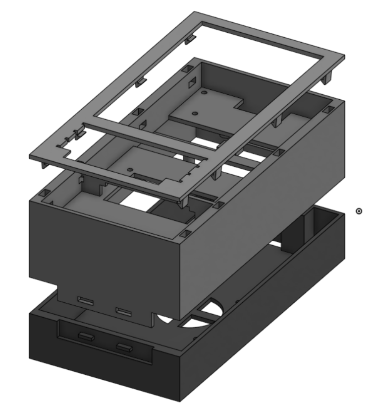

# 3d Model

The **BlackBerry Pi** case consists of **three separate** pieces that were meticulously designed using [Onshape](https://www.onshape.com/en/), a powerful cloud-based CAD platform. These components are optimized for 3D printing and tailored to accommodate the internal electronics of the project.

## Components

- **Front Panel**
Designed to frame the screen and keyboard area, this piece includes cutouts for the display and user input interface, preserving the classic BlackBerry look while integrating modern hardware.

- **Main Piece**
This is the central enclosure that houses the Raspberry Pi and other electronics. It features internal mounts and guides for secure placement of the components, ensuring structural integrity and easy assembly.

- **Back Panel**
Serves as the rear cover, with potential cutouts or vents for cooling. It snaps or screws into the main piece and can be removed for maintenance or upgrades.

## Printing & Assembly Notes

- All pieces are intended for **FDM 3D printing** and are designed with tolerances suitable for standard PLA filament.

- You may need to **add supports** for certain overhangs, especially in the main housing section.

- Consider using **M2.5 or M3 screws** if mechanical fasteners are desired.

- Total print time and filament usage will depend on your specific slicer settings and printer.

## License

These 3D model files are distributed under the terms of the **GNU General Public License v3.0 (GPLv3)**.
This means you are free to **use, study, modify, and distribute** the models, as long as any derivative works also remain open and licensed under the same GPLv3 terms.
For more information, see the [License page](../../LICENSE) in this repository.

> ⚠️ **Note:** As the project evolves, the 3D models may be subject to change. Check this repository regularly for updated versions or design improvements.